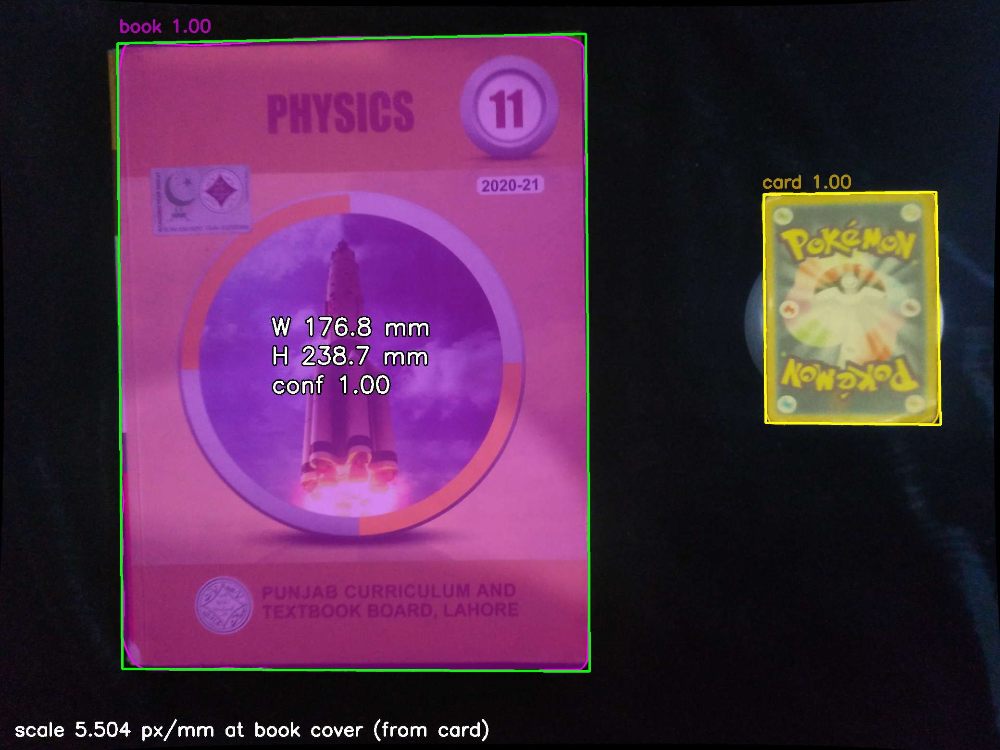
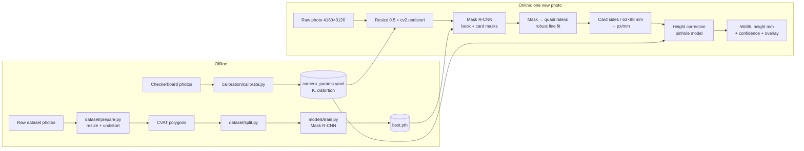

# Calibrated Book Measurement: Segmentation + Pixel-to-mm

An end-to-end computer vision pipeline that measures the real-world **width and height of a book in millimetres from a single phone photo**. It combines camera calibration, a fine-tuned Mask R-CNN model and a reference card of known size.

**Capabilities:**

- **Intrinsic camera calibration** (OpenCV, checkerboard) with lens-distortion removal. Reprojection error is **0.37 px**.
- **Instance segmentation** of books and a reference card with a fine-tuned **Mask R-CNN** (torchvision). Test results: **mask mAP@0.5 = 1.00, mAP@0.5:0.95 = 0.99, mask IoU = 0.97**.
- **Metric measurement** from the card-based pixel-to-mm ratio, with a pinhole-model **height correction**. On 20 photos of 10 books: **MAE 3.3 mm, MAPE 1.6%**.



## Results at a glance

| Stage | Key result | Report |
|---|---|---|
| Calibration | 29 images, RMS reprojection error 0.370 px (at 2080 × 1560) | [CALIBRATION_REPORT.md](docs/CALIBRATION_REPORT.md) |
| Dataset | 108 labelled images, 2 classes, 70/20/10 split stratified by book | [DATASET_CARD.md](docs/DATASET_CARD.md) |
| Segmentation | Test mask mAP@0.5:0.95 0.992, precision 0.95, recall 1.00, F1 0.98 | [TRAINING_REPORT.md](docs/TRAINING_REPORT.md) |
| Measurement | MAE 3.27 mm, MPE −0.06%, MAPE 1.61%, max 10 mm | [MEASUREMENT_REPORT.md](docs/MEASUREMENT_REPORT.md) |

## Pipeline architecture



**Data flow:** Every image, whether for training, inference or measurement, goes through the **same** `calibration.undistort.undistort()` call. It resizes the 13 MP capture to the 2080 × 1560 working resolution at which the camera was calibrated, then removes radial and tangential distortion. The model only ever sees undistorted images. The measurement stage converts the book and card masks to quadrilaterals, derives the scale from the card's known size, corrects that scale for the height difference between the card and the book cover, and reports the book's dimensions.

## Repository structure

```
calibration/     Checkerboard generator, calibration script, undistortion module,
                 calibration images, camera_params.yaml, visualisations
dataset/         raw/ captures, undistorted/ images, annotations/ (CVAT COCO export),
                 splits/ (train/val/test COCO), prepare.py, split.py
models/          config.yaml, Mask R-CNN setup, training/evaluation scripts, Colab notebook,
                 output/ (training history, curves, metrics; weights via Releases)
inference/       predict.py (undistort + segment), test/val prediction overlays
measurement/     measure.py (px→mm), demo.py, evaluate_accuracy.py, ground truth,
                 measurement photos, output/ (results, annotated images)
docs/            Calibration, dataset, training and measurement reports, setup guide
```

## Quick start

```bash
git clone https://github.com/abdullahks-devhub/xis-cv-assessment.git && cd xis-cv-assessment
conda create -n xis python=3.11 -y && conda activate xis
pip install -r requirements.txt
curl -L -o models/output/best.pth \
  https://github.com/abdullahks-devhub/xis-cv-assessment/releases/download/v1.0/best.pth

python -m measurement.demo --image measurement/images/book01_2.jpg --book-thickness-mm 12 --card-height-mm 16.3
```

For full installation, capture instructions and every stage's commands, see **[docs/SETUP.md](docs/SETUP.md)**.

## Module reference

### `calibration`

| Function / CLI | Description |
|---|---|
| `python -m calibration.make_board` | Writes `boards/checkerboard_screen.png` (full screen) and `checkerboard_A4.pdf` (print at 100%). 10 × 8 squares = 9 × 7 inner corners |
| `python -m calibration.calibrate --square-mm 23.7 --scale 0.5 [--max-error PX]` | Detects corners, calibrates, writes `camera_params.yaml` and visualisations. Prints the per-image and RMS reprojection error |
| `undistort.load_params(path) -> dict` | `{"K": 3×3, "dist": (5,), "image_size": (w, h), "capture_size": (w, h), "scale": float}` |
| `undistort.undistort(image, params) -> ndarray` | Accepts a 4160 × 3120 capture (resized automatically) or a 2080 × 1560 image. Raises `ValueError` for any other size |

### `dataset`

| CLI | Description |
|---|---|
| `python -m dataset.prepare [--src DIR --dst DIR --exclude NAMES]` | Undistorts every image in `src` |
| `python -m dataset.split [--seed 42]` | Applies label fixes and exclusions, then writes `splits/{train,val,test}.json` and `stats.json` |

### `models`

| Function / CLI | Description |
|---|---|
| `python -m models.train --config models/config.yaml [--epochs N --limit N]` | Trains; writes `best.pth`, `last.pth`, `history.csv`, `curves.png` |
| `python -m models.evaluate --weights best.pth --split test` | COCO mAP (box and mask), IoU, precision, recall and F1, written to `<split>_metrics.json`; overlays go to `inference/<split>_predictions/` |
| `common.build_model(cfg) / load_trained(cfg, weights, device)` | Mask R-CNN ResNet-50-FPN v2 with 3-class heads |
| `metrics.coco_map(ann_file, preds) / matching_metrics(...)` | Evaluation utilities |

### `inference`

`python -m inference.predict --input photo.jpg|folder [--out DIR]`

```python
from inference.predict import Segmenter
seg = Segmenter("models/output/best.pth")
image, detections = seg(cv2.imread("photo.jpg"))   # undistorted working image + detections
# detections (sorted by score): [{"class": "card", "score": 0.997, "box": [x0, y0, x1, y1], "mask": bool HxW}, ...]
```

The saved `<name>.json` looks like this:

```json
{"image": "book01_2.jpg",
 "detections": [{"class": "card", "score": 0.997, "box": [1585.8, 400.1, 1955.4, 884.9], "polygon": [[1800, 400], ...]},
                {"class": "book", "score": 0.9963, "box": [247.0, 76.1, 1224.7, 1396.2], "polygon": [[1098, 75], ...]}]}
```

### `measurement`

```python
from measurement.measure import measure
m = measure(image, detections, method="mask", focal_px=1499.3, cover_above_card_mm=12 - 16.3)
m.width_mm, m.height_mm, m.book_score, m.px_per_mm, m.camera_distance_mm, m.notes
```

| CLI | Output |
|---|---|
| `python -m measurement.demo --image photo.jpg [--book-thickness-mm T --card-height-mm H]` | Prints width, height and confidence. Writes `<name>_measured.jpg` (mask overlay and labels) and `<name>_measured.json` |
| `python -m measurement.evaluate_accuracy --card-height-mm 16.3` | `results.csv`, `summary.json` (MAE / MPE / MAPE for 4 variants), annotated images |

Demo JSON:

```json
{"image": "book01_2.jpg", "width_mm": 176.8, "height_mm": 238.7, "confidence": 0.996,
 "card_confidence": 0.997, "px_per_mm": 5.5044, "camera_distance_mm": 268.1, "notes": [],
 "overlay": "measurement/output/demo/book01_2_measured.jpg"}
```

## Design decisions

| Decision | Alternatives considered | Rationale |
|---|---|---|
| **Screen as the calibration target** | Printed board | No printer was available. A laptop panel is flatter and more rigid than paper |
| **Working resolution 2080 × 1560** | Full 13 MP | Full-resolution corner noise from the phone sensor gave 0.80 px error; half resolution gives 0.37 px with identical intrinsics (fx exactly halved). It still resolves about 0.2 mm per pixel |
| **Trading card as the reference** | ArUco marker, ID or bank card | Standardised size, no printer needed, no personal data, and it is segmented by the same model |
| **Mask R-CNN (torchvision)** | U-Net / DeepLab (semantic), Mask2Former | Per-object masks and confidence, native COCO mAP, strong COCO pretraining including a `book` class, and no YOLO or Roboflow dependency (both are excluded by the brief) |
| **Stratified split by book** | Random split | Guarantees every book is in train, val and test. The test set has exactly one photo per book |
| **Mask → robust line fit** | Min-area rectangle, image-edge snapping | Straight sides average out mask boundary noise. Edge snapping was tested and gave no gain (see measurement report) |
| **Pinhole height correction** | Ignore height differences | Reduced MAE from 4.56 to 3.27 mm. The error without it correlated with book thickness |
| **Colab for training, CPU for inference** | Local training | The development machine is an Intel Mac, where MPS lacks torchvision detection ops. Colab's T4 trains in about 20–30 minutes |

## Assumptions and limitations

- Photos come from **the calibrated camera at 4160 × 3120**, looking roughly straight down from about 25–40 cm, with the book and card fully in frame.
- The book cover and card are **parallel to the table**. The card's height relative to the cover is known, or zero.
- **One book and one card per image.** The most confident detection of each class is used.
- The model was trained on **10 specific books and one specific card**. The test metrics show generalisation to new photos of these objects, not to unseen books.
- Accuracy is limited mainly by the **ruler ground truth (±2 mm)**, non-rigid or worn covers, and the card's small size in the image. See the [error analysis](docs/MEASUREMENT_REPORT.md#7-error-analysis).
- The camera's focus could not be locked (legacy camera API), so focus distance was kept consistent instead. See the [calibration report](docs/CALIBRATION_REPORT.md#4-capture-procedure).

## Documentation

| Document | Contents |
|---|---|
| [docs/SETUP.md](docs/SETUP.md) | Installation, weights, capture guide, all commands, troubleshooting |
| [docs/CALIBRATION_REPORT.md](docs/CALIBRATION_REPORT.md) | Method, images, intrinsic matrix, distortion coefficients, reprojection error |
| [docs/DATASET_CARD.md](docs/DATASET_CARD.md) | Object choice, collection, labelling, class distribution, splits, exclusions |
| [docs/TRAINING_REPORT.md](docs/TRAINING_REPORT.md) | Model card, architecture choice, hyperparameters, loss curves, metrics |
| [docs/MEASUREMENT_REPORT.md](docs/MEASUREMENT_REPORT.md) | px→mm derivation, undistortion dependency, accuracy table, ablations, error analysis |
