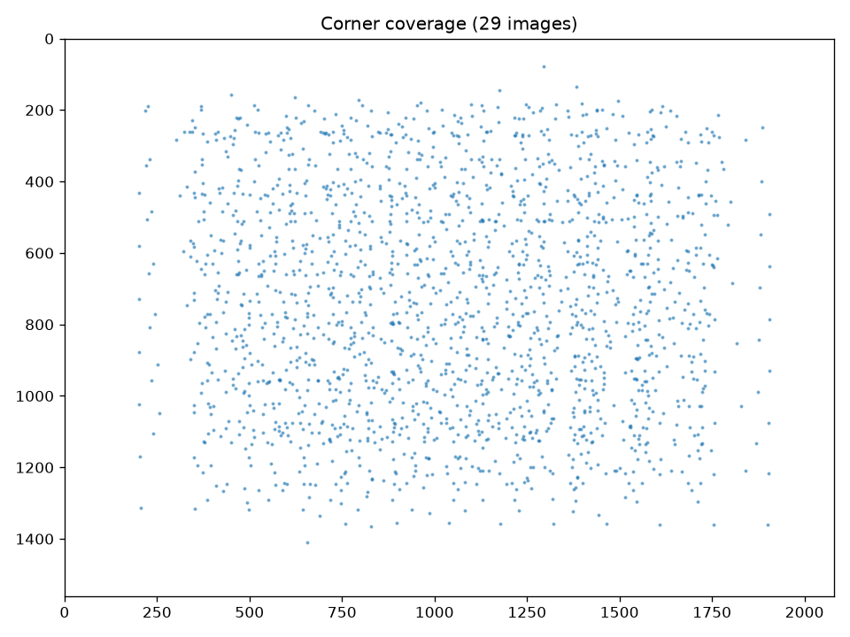
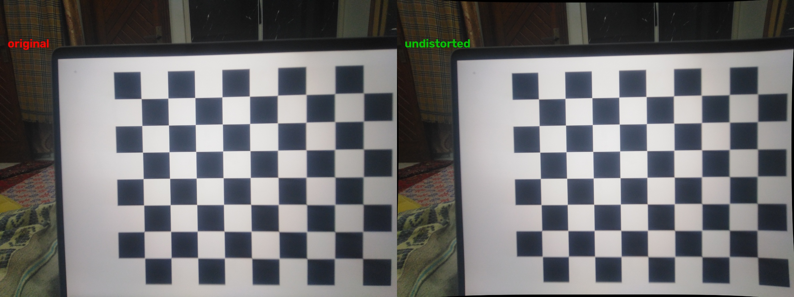

# Camera Calibration Report

## 1. Summary

| Item | Value |
|---|---|
| Camera | Huawei Y7 Prime 2019 (model LDN-L21), main rear camera, 3.37 mm lens |
| Capture resolution | 4160 × 3120 (13 MP) |
| Working resolution | **2080 × 1560** (capture × 0.5) |
| Method | Zhang's method, OpenCV `calibrateCamera`, 5-parameter Brown–Conrady distortion model |
| Target | Checkerboard, 9 × 7 inner corners, 23.7 mm squares |
| Images | 29 captured, **29 used** |
| RMS reprojection error | **0.370 px** (acceptable: < 0.5 px) |
| Parameters file | [`calibration/camera_params.yaml`](../calibration/camera_params.yaml) |

## 2. Why calibration is needed

A real lens does not follow the ideal pinhole model. It bends light, so straight lines in the world appear curved in the image. The amount of bending grows with distance from the image centre. For measurement this is a systematic error: an object near the frame edge is stretched or compressed by a different amount than the same object in the centre.

Intrinsic calibration estimates:

- **Camera matrix K**: focal lengths (fx, fy) in pixels and the principal point (cx, cy), which is where the optical axis meets the sensor.
- **Distortion coefficients**: radial terms (k1, k2, k3), which bend the image symmetrically around the centre, and tangential terms (p1, p2), which come from the lens not being perfectly parallel to the sensor.

With these values, `cv2.undistort()` remaps every pixel to where an ideal pinhole camera would have placed it. All later stages (dataset, inference and measurement) operate on undistorted images.

## 3. Calibration target

- **Pattern:** 10 × 8 squares, giving **9 × 7 inner corners** (the assessment minimum is 7 × 9). Generated by [`calibration/make_board.py`](../calibration/make_board.py).
- **Display:** No printer was available, so the pattern was shown full-screen on a 16" MacBook Pro Retina display (3072 × 1920). A laptop panel is a good calibration target: it is rigid and flat to well under 0.1 mm, while printed paper tends to curl or bend.
- **Square size:** Measured with a ruler across 9 squares (213 mm), giving **23.7 mm**. The square size only sets the scale of the estimated board poses (translation). It does **not** affect K or the distortion coefficients. Metric measurement later uses a separate reference object, so ruler precision here does not limit measurement accuracy.

## 4. Capture procedure

**Camera settings** (Open Camera app). These are kept identical for calibration, dataset and measurement images:

| Setting | Value | Reason |
|---|---|---|
| Resolution | 4160 × 3120 (max) | Intrinsics are resolution-specific |
| Orientation | Locked landscape | Mixed orientations would act as different cameras |
| Photo mode | Standard (no HDR/DRO/NR) | Multi-frame processing can warp geometry |
| Auto level | Off | It rotates and crops each image |
| Flash | Off | Glare on the target |
| Focus | Tap-to-focus at a fixed ~40 cm working distance | See the limitation below |

**Focus limitation:** The phone exposes only the legacy Android camera API, so Open Camera cannot lock focus or set it manually. Autofocus changes the lens position, which slightly changes the focal length ("focus breathing"). To keep this under control, all images were taken from a consistent working distance of about 35–45 cm, so autofocus settles to nearly the same lens position. The low reprojection error and the stable focal length across images (Section 6) show that this worked.

**Pose coverage:** 29 images across four groups:

1. Fronto-parallel, board centred (4)
2. Fronto-parallel, board shifted to each corner and edge of the frame (8)
3. Tilted about 20–40° from the left, right, above and below (12)
4. In-plane rotation about ±15–30° (4–5)

Tilted views constrain the focal length. Edge and corner placements constrain the distortion coefficients, which matter most far from the centre.

## 5. Processing

[`calibration/calibrate.py`](../calibration/calibrate.py):

1. Loads each image, rejects any that don't match the capture resolution, and resizes it to the working resolution (`INTER_AREA`).
2. Detects corners with `cv2.findChessboardCornersSB` (sector-based detector with sub-pixel accuracy). If that fails, it falls back to `findChessboardCorners` + `cornerSubPix`.
3. Runs `cv2.calibrateCamera` over all detections.
4. Computes the per-image RMS reprojection error. It can optionally drop outliers with `--max-error` and recalibrate (not needed here, since no outliers were dropped).
5. Writes the parameters to YAML, along with the corner visualisations, a coverage plot and a before/after undistortion image.

Reproduce:

```bash
python -m calibration.calibrate --square-mm 23.7 --scale 0.5
```

## 6. Results

### 6.1 Intrinsic matrix (working resolution 2080 × 1560)

```
K = | 1499.73     0.00   1043.52 |
    |    0.00  1498.90    777.29 |
    |    0.00     0.00      1.00 |
```

- **fx ≈ fy** (a 0.06% difference): the pixels are square, as expected for a phone sensor.
- **Principal point (1043.5, 777.3)** is within 4 px of the geometric image centre (1040, 780), so the lens is well centred.
- **Field of view:** 69.5° horizontal × 55.0° vertical.
- The focal length in pixels matches the lens metadata. The EXIF data gives 3.37 mm, and fx at full resolution (2997 px) implies a pixel pitch of about 1.12 µm, which is typical of a 13 MP sensor of this size.

### 6.2 Distortion coefficients

| k1 | k2 | p1 | p2 | k3 |
|---|---|---|---|---|
| 0.12545 | −0.24697 | −0.00017 | 0.00105 | 0.05795 |

- **Radial:** The positive k1 with a negative k2 produces a *moustache* profile. Toward the frame edges, pixels are pushed outward (pincushion). The higher-order term reverses this near the extreme corners (barrel). This pattern is common in compact phone lenses.
- **Tangential:** p1 and p2 are about 10⁻³ or smaller, so the lens is well aligned with the sensor.

**Size of the correction** (the distance a raw pixel moves when undistorted, at working resolution):

| Image location | Shift |
|---|---|
| Centre | 0 px |
| Quarter point (520, 390) | 9.1 px |
| Left edge midpoint | 8.1 px |
| Top edge midpoint | 13.1 px |
| Top-left corner | 40.4 px (extrapolated, see Limitations) |

At the ~40 cm working distance, one pixel covers about 0.27 mm (fx / 400 mm ≈ 3.75 px/mm). A 9–13 px error therefore corresponds to **2.4–3.5 mm** of measurement error on an object edge. This is why undistortion is mandatory before measurement.

### 6.3 Reprojection error

- **Overall RMS: 0.370 px**
- Per image: min 0.296 px, mean 0.366 px, max 0.561 px (`calib_28.jpg`, a steeply tilted view)
- Only one image is above 0.5 px, and none is an outlier. All per-image values are in [`camera_params.yaml`](../calibration/camera_params.yaml).

### 6.4 Visualisations

**Corner coverage:** every detected corner from all 29 images, plotted in image coordinates.



**Before / after undistortion** (`calib_28.jpg`). The curved black borders on the right show the remapping at the frame edges.



Detected corners for every image are in [`calibration/output/corners/`](../calibration/output/corners/).

## 7. Iterations and choice of working resolution

| Attempt | Conditions | Images detected | RMS @ 4160×3120 | RMS @ 2080×1560 |
|---|---|---|---|---|
| 1 | Dim room, handheld | 22 / 23 | 0.957 px | 0.457 px |
| 2 (final) | Room lit, max screen brightness, braced | 29 / 29 | 0.799 px | **0.370 px** |

**Diagnosis of attempt 1:** The per-image errors were uniformly high (0.56–1.50 px) rather than dominated by a few bad frames. That points to noise in corner localisation, not bad poses. Low light forced a long exposure and high sensor gain, which added noise and slight motion blur. Improving the lighting reduced the error by 17%.

**Why a working resolution of 0.5×:** Even with good lighting, full-resolution error stayed at about 0.8 px. That is a limit of this phone's small 1.12 µm pixels and its heavy JPEG and noise-reduction processing. Downscaling with area averaging combines each 2 × 2 block into one pixel, which averages out this noise. The calibration at both resolutions is consistent: fx is 2997.0 at full resolution and 1499.7 at half (ratio 0.5004), and the dominant distortion terms k1 and k2 agree to within about 0.01. The high-order k3 differs more (0.025 vs 0.058), because it is weakly constrained by corners near the frame edges. So the half-resolution model is the same physical camera, with more accurately located corners.

Half resolution is also enough for the task. At 40 cm it gives about 3.75 px/mm (0.27 mm per pixel), well below the ±1 mm resolution of the ruler used for ground truth. The segmentation model also runs on downscaled inputs.

**Consistency across the pipeline:** `calibration/undistort.py` stores the capture size and the scale. Any 4160 × 3120 capture is automatically resized to 2080 × 1560 before undistortion, and any other size raises an error. This guarantees the intrinsics are never applied at the wrong resolution.

## 8. Limitations

- **Edge and corner coverage:** Corners were detected across about 10–90% of the frame width and 5–90% of its height. The outermost regions have fewer samples, so the distortion estimate there (for example, the 40 px corner shift) is extrapolated and less reliable. Measured objects are placed near the frame centre, where coverage is dense.
- **No focus lock:** A fixed working distance keeps the focal length stable, but small autofocus differences between shots add a small error. Working distances very different from ~40 cm would need recalibration.
- **Board scale from a ruler:** The square size is known to about ±0.1 mm. This affects only the estimated board distances, not the intrinsics.
- **Phone image processing:** The phone may apply its own lens correction before saving the JPEG. In that case, this calibration models the *remaining* distortion of the saved images, which is exactly what the pipeline needs.
- **Screen as target:** LCD pixel structure and the protective glass add minor noise to corner positions. It is small compared with the sensor noise described above.

## 9. Files

| Path | Contents |
|---|---|
| `calibration/make_board.py` | Generates the screen PNG and printable PDF targets |
| `calibration/calibrate.py` | Calibration script |
| `calibration/undistort.py` | `load_params()`, `undistort()`, `to_working_size()`, used by all later stages |
| `calibration/images/calib_01–29.jpg` | Raw calibration captures (4160 × 3120) |
| `calibration/camera_params.yaml` | Intrinsics, distortion, per-image errors |
| `calibration/output/` | Corner visualisations, coverage plot, undistortion comparison |
