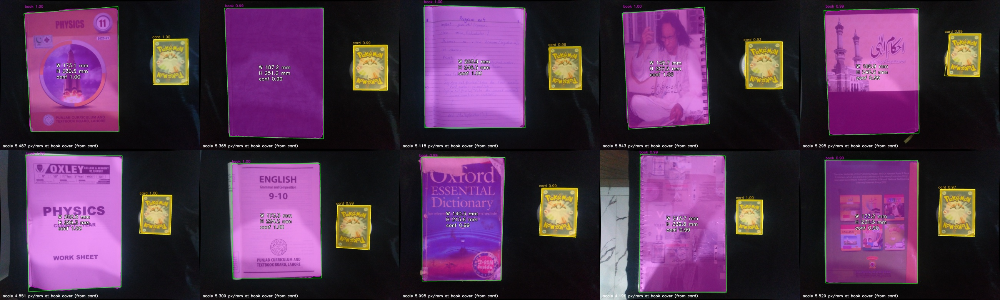

# Measurement Report: Pixel-to-Millimetre Conversion

## 1. Summary

The delivered pipeline measures book width and height from a single photo with:

| Metric | Width | Height | All (40 values) |
|---|---|---|---|
| **MAE** | 3.22 mm | 3.31 mm | **3.27 mm** |
| **MPE** (signed) | +0.69% | −0.81% | **−0.06%** |
| **MAPE** | 1.86% | 1.35% | **1.61%** |
| RMSE | 4.25 mm | 4.22 mm | 4.23 mm |
| Max abs. error | 8.9 mm | 10.0 mm | 10.0 mm |

These results come from **20 photos of 10 books** (2 per book), compared against ruler measurements (±2 mm). None of these photos were used for training.

**MPE** is the signed mean percentage error: near zero means no systematic over- or under-estimation. **MAPE** is the mean *absolute* percentage error, i.e. the typical size of an error. Both are reported because "MPE" is used for either in practice.

## 2. Pipeline

```
raw 4160×3120 ──resize 0.5──► 2080×1560 ──cv2.undistort(K, dist)──► undistorted image
      │                                                                    │
      │                                                         Mask R-CNN (book, card)
      │                                                                    │
      │                                            mask → quadrilateral (robust line fit per side)
      │                                                                    │
      │                     card sides (px) / (63, 88) mm ──► px/mm at the card plane
      │                                                                    │
      │           height correction (pinhole, focal length from K) ──► px/mm at the book cover
      │                                                                    │
      └────────────────────────────────► width = short side / px_per_mm, height = long side / px_per_mm
```

Code: [`measurement/measure.py`](../measurement/measure.py), with `measure()` as the core function. The single-image demo is [`measurement/demo.py`](../measurement/demo.py), and the validation script is [`measurement/evaluate_accuracy.py`](../measurement/evaluate_accuracy.py).

## 3. Methodology

### 3.1 Reference object

The reference is a trading card made to the standard size of **63 × 88 mm** (confirmed with a ruler). It is placed flat beside the book, and the same model segments it as a second class.

A card was chosen over an ArUco marker because no printer was available. It was chosen over an ID or bank card, which have the same ISO/IEC 7810 size, to avoid publishing personal data.

### 3.2 From mask to side lengths

A mask is a pixel region, but width and height are properties of a rectangle. For each mask:

1. Take the largest external contour and its minimum-area rectangle.
2. Assign each contour point to the nearest side of that rectangle. Keep only the middle 70% of each side, to ignore rounded card corners and slightly clipped book corners.
3. Fit a robust line (Huber loss, `cv2.fitLine`) to each side's points. Intersect neighbouring lines to get 4 corners.
4. Side lengths are the **means of opposite sides**, which averages out slight perspective.

Short side = width, long side = height.

### 3.3 Pixel-to-mm ratio (derivation)

Under the pinhole model, an object of real length *L* (mm) at distance *Z* (mm) from the camera appears with length

$$\ell = \frac{f\,L}{Z}$$

pixels, where *f* is the focal length in pixels. For our camera, f ≈ 1499.3 px at the working resolution (from the calibration). So the scale at a plane at distance *Z* is

$$s = \frac{\ell}{L} = \frac{f}{Z}\quad[\text{px/mm}]$$

The card gives this scale directly, averaged over both of its axes:

$$s_{card} = \tfrac{1}{2}\left(\frac{\ell_{short}}{63} + \frac{\ell_{long}}{88}\right)$$

### 3.4 Height correction

The scale above is only valid **at the card's plane**. The book's top cover sits at height *t* (the book thickness), and the card sat at height *h* on its support. If they differ, the cover is at a different distance from the camera and has a different scale. With Δz = t − h (how much higher the cover is than the card):

$$Z_{card} = \frac{f}{s_{card}},\qquad s_{book} = \frac{f}{Z_{card} - \Delta z} = s_{card}\cdot\frac{Z_{card}}{Z_{card}-\Delta z}$$

In the validation photos the card rested on a **16 mm support (16.3 mm including the card)**, while the books are 8–22 mm thick. So Δz ranges from −8.3 mm to +5.7 mm. At the measured camera distances of Z ≈ 256–363 mm, the error without correction is about Δz/Z, or **up to about 3%**.

### 3.5 Final dimensions

$$W = \frac{\ell_{short}^{book}}{s_{book}},\qquad H = \frac{\ell_{long}^{book}}{s_{book}}$$

The confidence is the Mask R-CNN score of the detected book, with 0.90–1.00 on all validation images.

## 4. Why undistortion is required

Lens distortion moves pixels by an amount that **depends on where they are in the frame**. For this camera (Section 6.2 of the [calibration report](CALIBRATION_REPORT.md)), the shift is 0 px at the centre, 8–13 px at the edge midpoints and more near the corners. At about 4–6 px/mm, that is **2–3 mm per object edge**. Using raw images therefore causes errors in three ways:

1. **Non-uniform scale:** The card and the book lie at different positions in the frame, so they are distorted by different amounts. The ratio measured on the card no longer applies to the book.
2. **Curved edges:** Straight book edges near the frame border appear bent. The fitted side lines, and so the side lengths, are biased.
3. **Position-dependent results:** The same book measures differently depending on where it lies in the frame. This violates the basic requirement of a measurement system.

**Experimental evidence:** The same 20 images were measured with every other step identical but **without** `cv2.undistort` (Section 6):

| | Undistorted | Raw (distorted) |
|---|---|---|
| Height MAE | **3.31 mm** | 4.66 mm |
| Height max error | **10.0 mm** | 16.8 mm |
| Overall MPE | **−0.06%** | −0.84% |
| Register height (book 9), photo 1 | **−6.2 mm** | −16.8 mm |
| Register height (book 9), photo 2 | **+0.4 mm** | −8.1 mm |

The effect is largest for the **Register** (346 mm tall). Its top and bottom edges lie near the frame edges, exactly where the calibration predicts the largest pixel shifts. For widths, which stay closer to the image centre, the two variants perform about the same (3.22 vs 3.18 mm). This is the expected pattern: distortion grows with distance from the optical centre.

## 5. Accuracy validation

**Protocol:** Each of the 10 books was measured with a ruler (width, height and thickness; ±2 mm). The values are in [`measurement/ground_truth.csv`](../measurement/ground_truth.csv). Each book was photographed twice, straight down from about 26–36 cm, with the card raised on a 16 mm support. Book 3 (the Maroon diary) was photographed open, and its ground truth describes the open state.

**Results for the delivered pipeline** (`final` variant):

| Image | Book | GT W | Meas. W | ΔW mm | ΔW % | GT H | Meas. H | ΔH mm | ΔH % | Z (mm) | Δz (mm) | Conf. |
|---|---|---|---|---|---|---|---|---|---|---|---|---|
| book01_1 | Physics book | 175 | 173.1 | −1.9 | −1.1 | 235 | 230.5 | −4.5 | −1.9 | 269 | −4.3 | 1.00 |
| book01_2 | Physics book | 175 | 176.8 | +1.8 | +1.0 | 235 | 238.7 | +3.7 | +1.6 | 268 | −4.3 | 1.00 |
| book02_1 | Gray diary | 187 | 187.2 | +0.2 | +0.1 | 250 | 251.2 | +1.1 | +0.5 | 274 | −5.3 | 0.99 |
| book02_2 | Gray diary | 187 | 184.9 | −2.1 | −1.1 | 250 | 252.4 | +2.4 | +1.0 | 274 | −5.3 | 0.99 |
| book03_1 | Maroon diary (open) | 197 | 203.9 | +6.9 | +3.5 | 250 | 246.3 | −3.7 | −1.5 | 288 | −5.3 | 1.00 |
| book03_2 | Maroon diary (open) | 197 | 203.2 | +6.2 | +3.1 | 250 | 247.3 | −2.7 | −1.1 | 286 | −5.3 | 0.99 |
| book04_1 | White diary | 146 | 145.7 | −0.3 | −0.2 | 210 | 207.2 | −2.8 | −1.3 | 256 | −0.3 | 1.00 |
| book04_2 | White diary | 146 | 144.6 | −1.4 | −0.9 | 210 | 205.5 | −4.5 | −2.1 | 257 | −0.3 | 1.00 |
| book05_1 | Ahkam e Ilahi | 186 | 180.9 | −5.1 | −2.7 | 246 | 245.2 | −0.8 | −0.3 | 285 | +1.7 | 0.99 |
| book05_2 | Ahkam e Ilahi | 186 | 184.3 | −1.7 | −0.9 | 246 | 244.2 | −1.8 | −0.7 | 289 | +1.7 | 0.99 |
| book06_1 | Oxley worksheet | 202 | 202.6 | +0.6 | +0.3 | 288 | 286.3 | −1.7 | −0.6 | 314 | +4.7 | 1.00 |
| book06_2 | Oxley worksheet | 202 | 200.7 | −1.3 | −0.6 | 288 | 282.6 | −5.4 | −1.9 | 302 | +4.7 | 1.00 |
| book07_1 | English grammar | 175 | 173.3 | −1.7 | −1.0 | 233 | 224.2 | −8.8 | −3.8 | 282 | −0.3 | 1.00 |
| book07_2 | English grammar | 175 | 175.2 | +0.2 | +0.1 | 233 | 223.0 | −10.0 | −4.3 | 282 | −0.3 | 1.00 |
| book08_1 | Oxford dictionary | 133 | 140.3 | +7.3 | +5.5 | 213 | 213.8 | +0.8 | +0.4 | 256 | +5.7 | 0.99 |
| book08_2 | Oxford dictionary | 133 | 140.7 | +7.7 | +5.8 | 213 | 216.5 | +3.5 | +1.6 | 262 | +5.7 | 0.99 |
| book09_1 | Register | 210 | 213.7 | +3.7 | +1.7 | 346 | 339.8 | −6.2 | −1.8 | 359 | +1.7 | 0.99 |
| book09_2 | Register | 210 | 218.9 | +8.9 | +4.2 | 346 | 346.4 | +0.4 | +0.1 | 363 | +1.7 | 0.99 |
| book10_1 | Computer education | 178 | 173.2 | −4.8 | −2.7 | 232 | 231.3 | −0.7 | −0.3 | 263 | −8.3 | 0.90 |
| book10_2 | Computer education | 178 | 177.4 | −0.6 | −0.3 | 232 | 232.8 | +0.8 | +0.3 | 269 | −8.3 | 0.91 |

**Z** is the camera-to-card distance estimated from the card's size. **Δz** is the cover height minus the card height.

Full per-variant results are in [`measurement/output/results.csv`](../measurement/output/results.csv), and the summary is in [`summary.json`](../measurement/output/summary.json).



## 6. Ablation: which steps matter

| Variant | Undistort | Quad method | Height corr. | MAE mm | MPE % | MAPE % | Max mm |
|---|---|---|---|---|---|---|---|
| **final** | ✓ | mask | ✓ | **3.27** | **−0.06** | **1.61** | **10.0** |
| edge_refined | ✓ | edge | ✓ | 3.32 | +0.05 | 1.65 | 10.1 |
| no_height_corr | ✓ | mask | ✗ | 4.56 | −0.42 | 2.27 | 10.9 |
| distorted | ✗ | mask | ✓ | 3.92 | −0.84 | 1.80 | 16.8 |

- **Height correction** is the largest single improvement: it reduces MAE by 28%. Without it, the error correlates clearly with book thickness. The thinnest book (8 mm) came out about 3% small and the thickest (22 mm) about 4–6% large, which is what the pinhole model predicts for a card fixed at 16.3 mm.
- **Undistortion** mainly protects large objects that reach the frame edges (Section 4). It cuts the worst-case error from 16.8 to 10.0 mm.
- **Edge refinement**, which snaps each mask side to the strongest nearby image gradient with sub-pixel precision, gave **no gain** (3.32 vs 3.27 mm). The masks are already accurate enough (test mask IoU 0.97), and on covers with printed borders the strongest gradient is sometimes a design element rather than the physical edge. The simpler mask-based method was kept as the default. Edge refinement remains available as `method="edge"`.
- A per-axis card scale (a separate scale along the card's short and long sides, to model tilt) was also tried. It performed worse (MAE 6.0 mm) than averaging both axes, so it was dropped.

## 7. Error analysis

The remaining errors have identifiable causes:

| Source | Evidence | Typical size |
|---|---|---|
| **Ground-truth quality** | The ruler reading is ±2 mm. Book 3's open width was estimated ("closed width + 1 cm"), and it carries the largest width errors (+6–7 mm) | 1–3% |
| **Non-rectangular objects** | Book 8 (dictionary) has a worn, frayed cover and measures +7 mm wide in both photos (repeatable, so not noise). Book 7 is a limp paperback whose cover is partly folded back, and it measures −9 to −10 mm tall in both photos. The segmented outline differs from the rigid edge the ruler measures | up to 4–6% |
| **Card scale** | The card spans only about 260–365 × 365–515 px. A 2 px boundary error on each side changes the scale by about 1%, and this propagates to both dimensions. In every photo the card's long side appears about 4% short relative to its short side, consistent with a slight tilt of the card on its round support | about 1% |
| **Camera tilt** | Handheld shots are not perfectly perpendicular. The difference between two photos of the same book (e.g. book 1: −1.9% vs +1.6% height) is mostly this | 1–2% |
| **Mask resolution** | Mask R-CNN predicts masks on a 28 × 28 grid, limiting boundary precision to a few pixels (IoU 0.97) | < 1% |

Excluding the three books with known shape or ground-truth issues (3, 7, 8), the MAE is 2.5 mm.

## 8. Assumptions and limitations

- **Planar, top-down setup:** The book cover and the card are parallel to the table, and the camera looks roughly straight down. Strong camera tilt would need a full homography from the card corners. That was not used because a small reference extrapolates poorly to a large book.
- **Known heights:** The height correction needs the book's thickness and the card's height above the table. For best results in practice, raise the card to the height of the cover so that Δz = 0.
- **Same camera, same settings:** The measurement relies on this camera's calibration (distortion and focal length) and on photos taken at 4160 × 3120.
- **One book and one card per image:** The most confident detection of each class is used. Additional books trigger a note.
- **Rigid, rectangular books:** Worn, bent or open books are measured as their visible outline.
- **Small validation set:** 10 books × 2 photos. The confidence interval on the MAE is wide (roughly ±1 mm).

## 9. Usage

```bash
# single image -> width, height, confidence, overlay
python -m measurement.demo --image photo.jpg --book-thickness-mm 12 --card-height-mm 16.3

# full accuracy validation (all variants)
python -m measurement.evaluate_accuracy --card-height-mm 16.3
```

Example output:

```
Width:      176.8 mm
Height:     238.7 mm
Confidence: 0.996
Overlay:    measurement/output/demo/book01_2_measured.jpg
```

Module documentation is in the [README](../README.md#module-reference).
