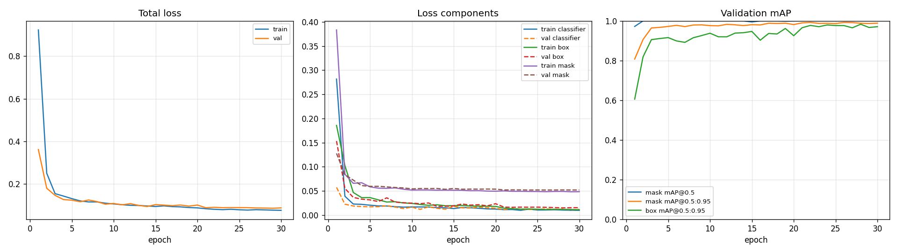
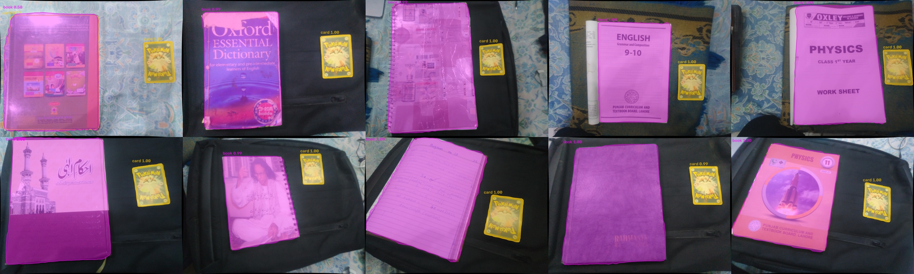

# Training Report: Mask R-CNN for Book and Card Segmentation

## 1. Summary

| | Test (10 images) | Val (22 images) |
|---|---|---|
| **Mask mAP@0.5** | **1.000** | 1.000 |
| **Mask mAP@0.5:0.95** | **0.992** | 0.992 |
| Box mAP@0.5 | 1.000 | 1.000 |
| Box mAP@0.5:0.95 | 0.977 | 0.977 |
| **Mean mask IoU** (matched) | **0.969** | 0.970 |
| Precision / Recall / F1 | 0.952 / 1.000 / 0.976 | 0.978 / 1.000 / 0.989 |

Precision, recall, F1 and IoU are computed at a confidence of ≥ 0.5 and a mask IoU of ≥ 0.5, with one-to-one matching. The single test error is one extra `card` detection.

The raw values are in [`models/output/test_metrics.json`](../models/output/test_metrics.json) and [`val_metrics.json`](../models/output/val_metrics.json).

## 2. Model card

| Item | Value |
|---|---|
| Architecture | **Mask R-CNN, ResNet-50-FPN v2** (`torchvision.models.detection.maskrcnn_resnet50_fpn_v2`) |
| Initialisation | COCO-pretrained (`MaskRCNN_ResNet50_FPN_V2_Weights.COCO_V1`), with the box and mask predictors replaced for 3 classes (background, `book`, `card`) |
| Input | Undistorted RGB, 2080 × 1560, resized internally to 1365 × 1024 (`min_size 1024`, `max_size 1400`) |
| Output | Per object: class, confidence, box and a soft mask (thresholded at 0.5), up to 20 per image |
| Parameters | About 46 M |
| Weights | `models/output/best.pth` (184 MB, too large for git), distributed as a GitHub Release asset. See [SETUP.md](SETUP.md) |
| Selected checkpoint | Epoch 22 of 30 (highest val mask mAP@0.5:0.95) |
| Intended use | Segmenting books and the reference card in top-down photos from the calibrated camera, as input to metric measurement |
| Not intended for | Other cameras without recalibration, other object types, cluttered scenes |

## 3. Why Mask R-CNN

The assessment excludes Roboflow and Ultralytics YOLO models. Among the remaining options, Mask R-CNN was chosen for these reasons:

- **Instance segmentation:** It separates each object (book 1, book 2, card) and gives each its own confidence score. The measurement step needs exactly that: pick the best book and the best card, then compute the scale from the card. Semantic segmentation models (U-Net, DeepLabV3) output only a per-pixel class map, with no instances, no confidence per object and no COCO-style mAP.
- **Pretrained on COCO:** COCO includes a `book` category, so the pretrained features already respond to book-like objects. Fine-tuning with about 76 images is therefore reliable, whereas training from scratch would need thousands of images.
- **Standard metrics:** It is evaluated natively with COCO mAP@0.5 and mAP@0.5:0.95 for both boxes and masks, which are the metrics the assessment asks for.
- **Mature and reproducible:** It is part of torchvision, so no extra framework is needed, and the whole pipeline is plain PyTorch.
- **v2 weights:** The improved training recipe gives higher COCO mask AP (41.8 vs 34.6 for v1) at the same inference cost.

**Trade-off:** Mask R-CNN predicts each mask on a 28 × 28 grid inside the object's box, so boundaries are approximated by upsampling. For large objects this limits edge precision to a few pixels. Measurement accounts for this by fitting straight lines to the mask sides. Transformer models (Mask2Former, SAM-based fine-tuning) can give sharper edges, but they are heavier, and a 76-image dataset gives them little to gain.

## 4. Training configuration

All settings live in [`models/config.yaml`](../models/config.yaml). A copy of the exact configuration used is stored in [`models/output/config_used.yaml`](../models/output/config_used.yaml).

| Hyperparameter | Value | Rationale |
|---|---|---|
| Epochs | 30 | Val mAP plateaus by about 20 (Section 5) |
| Batch size | 2 | Fits a 16 GB T4 at 1365 × 1024 |
| Optimiser | SGD, momentum 0.9, weight decay 1e-4 | The torchvision reference recipe for Mask R-CNN |
| Learning rate | 0.005, linear warm-up over 50 iterations | The reference LR of 0.02 for batch size 16, scaled down for batch size 2 |
| LR schedule | ×0.1 at epochs 20 and 26 | Step decay for the final refinement |
| Seed | 42 | Python, NumPy and PyTorch are all seeded |

**Augmentation** (training only, applied to images and masks together):

| Augmentation | Probability / range | Why |
|---|---|---|
| Horizontal flip | 0.5 | Books and card appear in any left/right arrangement |
| Vertical flip | 0.5 | Top-down views have no preferred "up" direction |
| 90° rotation | 0.5 | Books appear in portrait and landscape orientation |
| Colour jitter | brightness / contrast / saturation 0.3, hue 0.03 | Different lighting, glare, white balance |

No geometric scaling or perspective warps are applied. Object size in pixels carries metric meaning downstream, and the training images already cover a range of distances.

**Hardware:** Google Colab, NVIDIA T4 (16 GB). The notebook is [`models/train_colab.ipynb`](../models/train_colab.ipynb). It clones the repository and runs `python -m models.train`, so no training logic lives in the notebook.

## 5. Training curves



The per-epoch values are in [`models/output/history.csv`](../models/output/history.csv).

| Epoch | Train loss | Val loss | Val mask mAP@0.5:0.95 | Val box mAP@0.5:0.95 |
|---|---|---|---|---|
| 1 | 0.923 | 0.361 | 0.808 | 0.608 |
| 3 | 0.154 | 0.146 | 0.965 | 0.906 |
| 10 | 0.106 | 0.108 | 0.976 | 0.939 |
| 20 | 0.087 | 0.101 | 0.982 | 0.926 |
| **22 (best)** | **0.081** | **0.090** | **0.992** | **0.977** |
| 30 | 0.076 | 0.087 | 0.989 | 0.971 |

**Observations:**

- **Fast convergence:** Val mask mAP@0.5:0.95 passes 0.96 by epoch 3. The COCO-pretrained backbone and heads already represent object boundaries well. Only the class-specific heads have to adapt.
- **No overfitting:** Validation loss tracks training loss throughout, with a gap of about 0.01 by the end. It does not rise after the LR drops.
- **LR drop at epoch 20** gives a clear step down in both losses and the best checkpoint two epochs later.
- **The mask loss dominates** the remaining loss (about 0.05 of 0.08). Classification and box losses reach about 0.01. This matches the 28 × 28 mask resolution limit described in Section 3.
- **Box mAP@0.5:0.95 is below mask mAP.** The strict thresholds (IoU 0.85–0.95) penalise small box offsets on the small card more than they penalise its mask.

## 6. Qualitative results (held-out test set)



Each test image shows one book (magenta) and the card (orange), with confidence scores. The book masks follow the covers, including spines and spiral bindings. The lowest book confidence (0.58) is on `img_001`, a glossy cover with strong glare on a patterned bed sheet.

Per-image overlays are in [`inference/test_predictions/`](../inference/test_predictions/) and [`inference/val_predictions/`](../inference/val_predictions/).

## 7. Limitations and caveats

- **The scores are optimistic.** The test images are new photos of the *same ten books* used in training, often on the same backgrounds. The metrics show reliable segmentation for this setup, not generalisation to unseen books or scenes. A book-level hold-out would be the stronger test, but it would leave only 1–2 books for testing.
- **Small test set:** 10 images, with 20 objects. A single error moves precision by about 5 percentage points.
- **One label error in training:** In `img_002.jpg` the book and card labels were swapped in the CVAT export. It was found after training by an area check and has now been fixed in `dataset/split.py` (see [DATASET_CARD.md](DATASET_CARD.md)). The delivered model was trained with this one swapped pair (2 of 152 training instances). Validation and test labels were correct, so the metrics above are unaffected, and the impact on the model is expected to be negligible. Retraining with `python -m models.train` reproduces the model on the corrected labels.
- **Mask boundary resolution** is limited by the 28 × 28 mask head (Section 3). This is the main source of the remaining mask loss.

## 8. Reproduce

```bash
python -m dataset.split                                              # splits (seeded)
python -m models.train --config models/config.yaml                   # about 20–30 min on a Colab T4
python -m models.evaluate --weights models/output/best.pth --split test
python -m inference.predict --input path/to/photo.jpg                # inference on a new image
```

Inference usage and module documentation are in the [README](../README.md).
